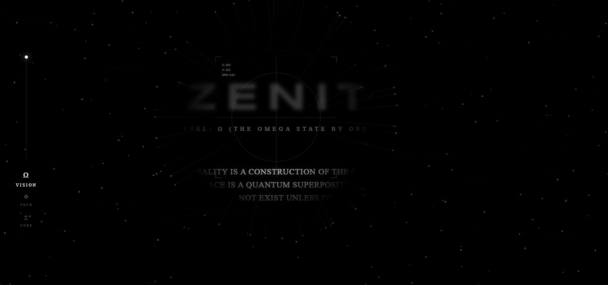

# zenith_-the-invisible-architecture
div align="center">
  

  <h1>zenith_-the-invisible-architecture</h1>
  
A High-End Creative landing page merging UI with Modern Web Engineering who blowed your mind!!!

  
 <a href="https://vercel.com/touseef-panjtans-projects/zenith_-the-invisible-architecture">
    
    
  </a>

